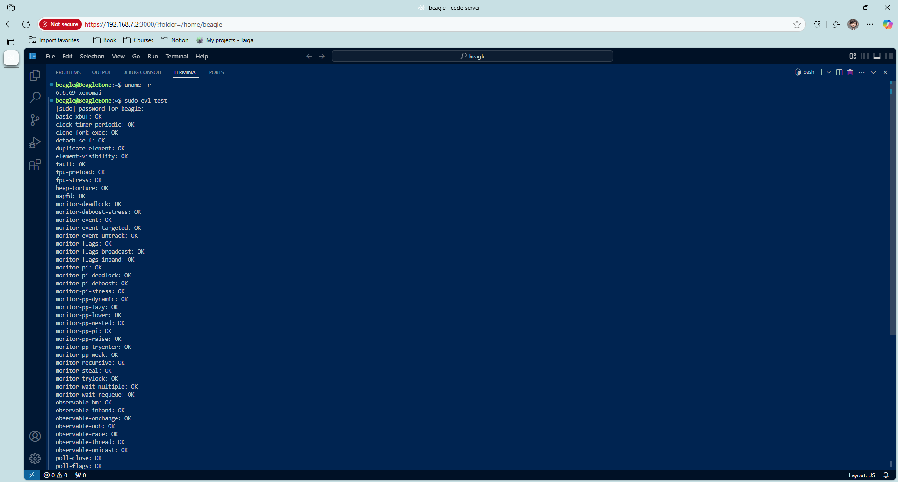

+++
title = "Integrating Xenomai 4 on BeagleY-AI: Hard Real-Time Linux"
description = "Building on our Preempt-RT kernel for μs-level determinism"
date = 2025-05-28
[taxonomies]
tags = ["BeagleY-AI", "Linux Kernel", "Xenomai4"]
+++

### **Why Xenomai?**  
While Preempt-RT provides soft real-time capabilities, **Xenomai 4** delivers **hard real-time performance** via its EVL (Evolvable Linux) core. This dual-kernel approach achieves:  
- **Sub-10μs latency** for time-critical tasks  
- **Deterministic interrupt handling**  
- **Coexistence** of real-time and Linux applications  

---

## **Prerequisites**  
1. **BeagleY-AI** running [Debian 12.11 2025-05-21 XFCE](https://www.beagleboard.org/distros/beagley-ai-debian-12-11-2025-05-21-xfce-v6-6-x-ti)
2. **Host Machine**: Ubuntu 22.04+ (64-bit) with ARM cross-compiler  

---

## **Step 1: Obtain Kernel Sources**  
*(Host Machine)*  

### **1.1 Clone Beagleboard’s Linux Kernel**  
```bash
git clone https://github.com/beagleboard/linux -b 6.6.58-ti-rt-arm64-r27
cd linux
```

### **1.2 Fetch Xenomai EVL Patches**  
```bash
git remote add xenomai https://source.denx.de/Xenomai/xenomai4/linux-evl.git
git fetch xenomai v6.6.y-evl-rebase
```

## **Step 2: Merge EVL into TI Kernel**  
### **2.1 Create a Merge Branch**  
```bash
git checkout -b ti-xenomai-merge
git merge xenomai/v6.6.y-evl-rebase
```

### **2.2 Resolve Merge Conflicts**  
Focus on:  
- **`arch/arm64`** (TI-specific changes vs. Xenomai’s EVL modifications)  
- **`drivers/`** (e.g., SPI, PWM, or Ethernet drivers)  
- **`kernel/sched`** (scheduler conflicts between RT and EVL)  

---

## **Step 3: Configure the Kernel**  
### **3.1 Start with BeagleY’s Default Config**  
```bash
make distclean
make ARCH=arm64 CROSS_COMPILE=aarch64-linux-gnu- bb.org_defconfig
```

### **3.2 Enable Xenomai EVL**  
```bash
make ARCH=arm64 CROSS_COMPILE=aarch64-linux-gnu- menuconfig
```
**Key Options**:  
```bash
->Kernel Features                                                                                              
    -> [*]EVL real-time core
        [*]   Enable quota-based scheduling 
        [*]   Enable temporal partitioning policy
        (4)     Number of partitions
        [ ]   Optimize for intra-core concurrency 
        [*]   Collect runtime statistics
        [ ]   Out-of-band networking (EXPERIMENTAL)
        Fixed sizes and limits  --->
        Pre-calibrated latency  --->
        [*]   Debug support  --->          
```

---

## **Step 4: Build the Kernel**  
### **4.1 Compile Kernel & Modules**  
```bash
make ARCH=arm64 CROSS_COMPILE=aarch64-linux-gnu- \
    LOCALVERSION="-xenomai" -j$(nproc)
make ARCH=arm64 CROSS_COMPILE=aarch64-linux-gnu- \
     INSTALL_MOD_PATH=./modules modules_install
```

### **4.2 Package Artifacts**  
```bash
tar -czf xenomai-kernel-6.6.69-xenomai.tar.gz \
    arch/arm64/boot/Image modules/lib/modules/6.6.69-xenomai
```

---

## **Step 5: Deploy EVL Kernel**  
### **5.1 Install on Target** 
*(Target Device BeagleY-AI)*  
- Copy `arch/arm64/boot/Image` to `/BOOT/`  
- Extract modules to `/lib/modules`  
- Update `/boot/firmware/extlinux/extlinux.conf`:  
```ini
label microSD (default)
    kernel /Image
    append console=ttyS2,115200n8 root=/dev/mmcblk1p3 ro rootfstype=ext4 resume=/dev/mmcblk1p2 rootwait net.ifnames=0 quiet
    fdtdir /
    fdt /ti/k3-am67a-beagley-ai.dtb
    fdtoverlays /overlays/k3-am67a-beagley-ai-csi0-tevs-rpi22.dtbo
    initrd /initrd.img
```
Validate the kernel version with `uname -r` and will get:
```bash
$ uname -r
6.6.69-xenomai
```

## **Step 6: Build & Install Xenomai Libraries**  
*(Native on BeagleY-AI)*  

### **6.1 Clone Source**  
```bash  
mkdir ~/xenomai && cd ~/xenomai  
git clone https://source.denx.de/Xenomai/xenomai4/libevl.git  
git clone https://source.denx.de/Xenomai/xenomai4/linux-evl.git \
  --depth=1 --branch v6.6.y-evl-rebase  
```

### **6.2 Build libevl**  
```bash  
mkdir build && cd build  
meson setup -Dbuildtype=release -Dprefix=/usr \
            -Duapi=~/xenomai/linux-evl ../libevl  
meson compile  
sudo ninja install  
```


## **6.3 Validate with EVL test** 
```bash
sudo evl test
```
**Expected Output**:  
```plaintext
$ sudo evl test
basic-xbuf: OK
clock-timer-periodic: OK
clone-fork-exec: OK
detach-self: OK
duplicate-element: OK
element-visibility: OK
fault: OK
fpu-preload: OK
fpu-stress: OK
heap-torture: OK
mapfd: OK
monitor-deadlock: OK
monitor-deboost-stress: OK
monitor-event: OK
monitor-event-targeted: OK
monitor-event-untrack: OK
monitor-flags: OK
monitor-flags-broadcast: OK
monitor-flags-inband: OK
monitor-pi: OK
monitor-pi-deadlock: OK
monitor-pi-deboost: OK
monitor-pi-stress: OK
monitor-pp-dynamic: OK
monitor-pp-lazy: OK
monitor-pp-lower: OK
monitor-pp-nested: OK
monitor-pp-pi: OK
monitor-pp-raise: OK
monitor-pp-tryenter: OK
monitor-pp-weak: OK
monitor-recursive: OK
monitor-steal: OK
monitor-trylock: OK
monitor-wait-multiple: OK
monitor-wait-requeue: OK
observable-hm: OK
observable-inband: OK
observable-onchange: OK
observable-oob: OK
observable-race: OK
observable-thread: OK
observable-unicast: OK
poll-close: OK
poll-flags: OK
poll-many: OK
poll-multiple: OK
poll-nested: OK
poll-observable-inband: OK
poll-observable-oob: OK
poll-sem: OK
poll-xbuf: OK
proxy-echo: OK
proxy-eventfd: OK
proxy-pipe: OK
proxy-poll: OK
ring-spray: OK
rwlock-read: OK
rwlock-write: OK
sched-quota-accuracy: 99.0%
sched-tp-accuracy: OK
sched-tp-overrun: OK
sem-close-unblock: OK
sem-flush: OK
sem-timedwait: OK
sem-wait: OK
simple-clone: OK
stax-lock: OK
stax-warn: OK
thread-mode-bits: OK
```


---

### **Conclusion**
You've now transformed your BeagleBone Black into a **hard real-time platform**:  
1. Combined Preempt-RT and Xenomai EVL  
2. Achieved **single-digit microsecond latency**  
3. Enabled deterministic control for robotics/industrial apps  

**Next Steps**:
- Coming soon

---

### **References**
1. [Xenomai Official Documentation](https://xenomai.org/documentation/)  
2. [EVL Kernel Patches](https://source.denx.de/Xenomai/xenomai4/linux-evl)  
3. [Real-Time Systems Design Guide](https://www.osadl.org/Realtime-Linux.projects-realtime-linux.0.html)


